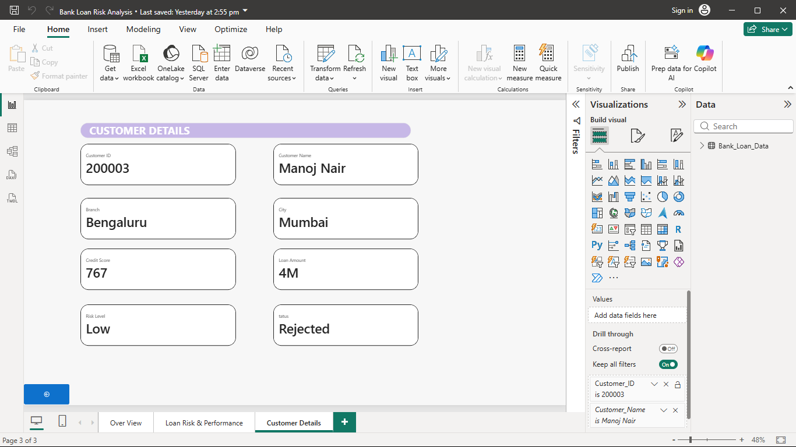

# 🏦 Bank Loan Risk Analysis Dashboard

An interactive **Power BI** dashboard built using **10,000 customer loan records** to analyze loan performance, customer risk, approval trends, and branch performance.

---

## 📷 Dashboard Preview

### Executive Overview

### Loan Risk & Performance

### Customer Drill-through

---

## 📌 Business Problem

Banks require a centralized dashboard to monitor loan performance, identify high-risk customers, compare branch performance, and support data-driven lending decisions.

---

## 🛠️ Tools Used

* Power BI
* DAX
* SQL
* Excel

---

## 📊 Features

* Executive KPI Dashboard
* Loan Approval Analysis
* Risk Segmentation
* Branch & City Performance
* Interactive Slicers
* Customer Drill-through

---

## 💡 Key Insights

* 10,000 customer loan applications analyzed
* Branch-wise loan performance comparison
* High-risk customer identification
* Customer-level drill-through for detailed investigation

---

## 🚀 Skills Demonstrated

* Data Cleaning
* Data Modeling
* DAX Measures
* Interactive Drill-through
* Business Intelligence
* Data Visualization
