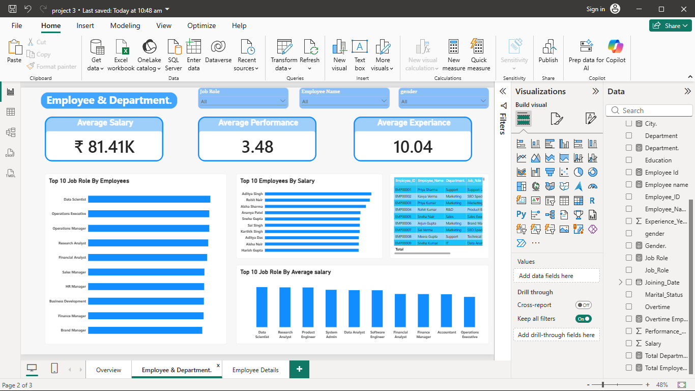
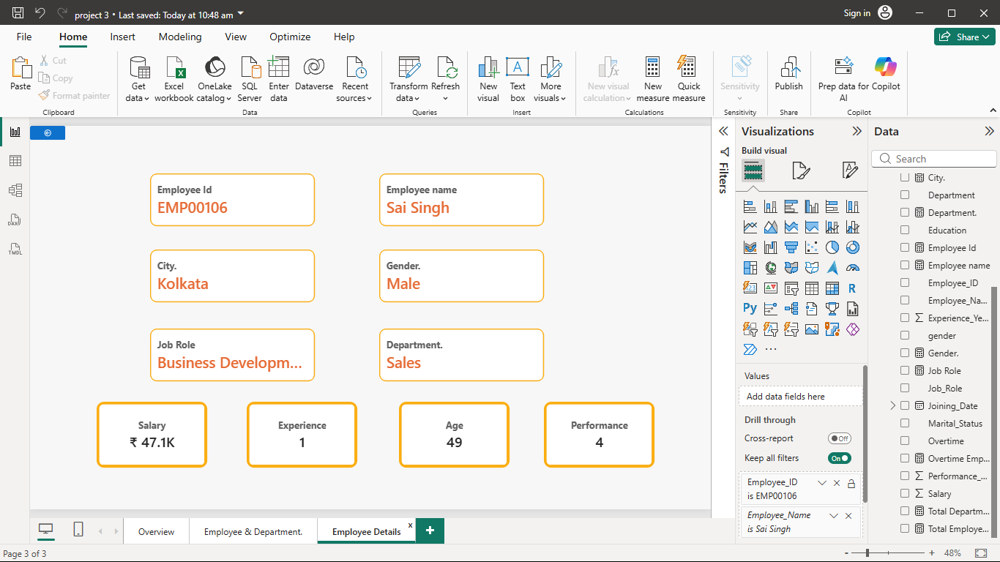

# 👥 HR Analytics Dashboard

An interactive **Power BI** dashboard built using **10,000 employee records** to analyze workforce performance, employee attrition, salaries, department insights, and demographics.

---

## 📊 Dashboard Preview

### Executive Overview

### Employee & Department

### Employee Details (Drill-through)

---

## 🎯 Business Problem

HR teams need a centralized dashboard to monitor employee attrition, salary trends, department performance, workforce demographics, and individual employee insights for better strategic decision-making.

---

## 🛠️ Tools Used

* Power BI
* DAX
* Excel
* Data Modeling

---

## ✨ Dashboard Features

* Executive HR KPI dashboard
* Employee attrition analysis
* Salary & department insights
* Job role performance analysis
* Interactive slicers (Department, City & Gender)
* Employee drill-through page

---

## 📈 Key Insights

* Analyzed **10,000 employee records**
* Compared workforce distribution across departments
* Identified attrition trends and salary patterns
* Highlighted top job roles and high-performing employees
* Enabled employee-level drill-through analysis

---

## 📁 Project Files

* `HR-Analytics-Dashboard.pbix`
* `HR_Analytics_Dataset_10000.xlsx`
* `Screenshots/Overview.png`
* `Screenshots/Employee_Department.png`
* `Screenshots/Employee_Details.png`

---

## 👨‍💻 Author

**S. Ravindranathan**
