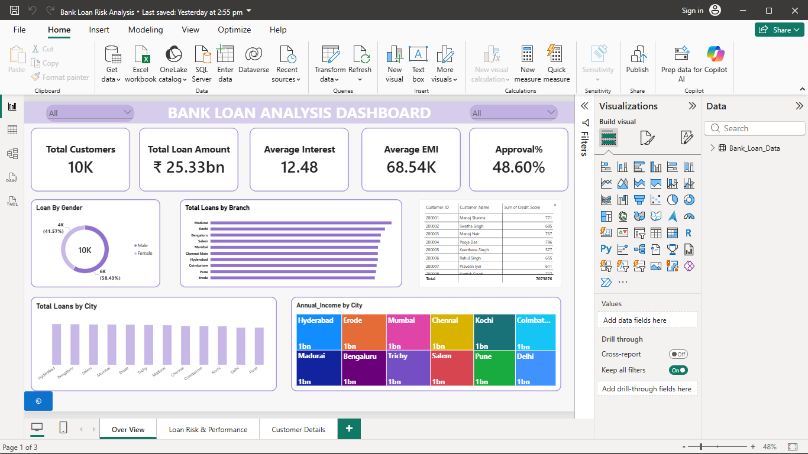
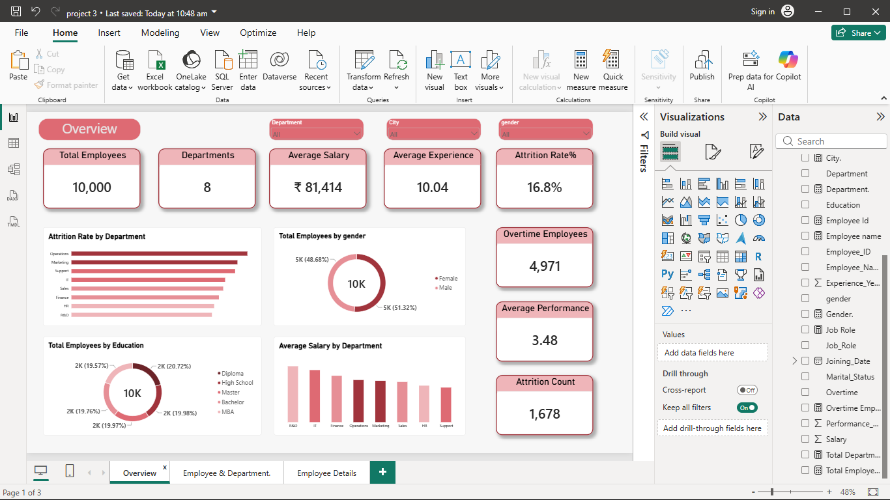

# 👋 Hi, I'm S. Ravindranathan

## Aspiring Data Analyst

I'm passionate about transforming raw data into meaningful business insights using **Power BI, SQL, Excel, Python, and DAX**.

---

# 🚀 Featured Projects

## 🏦 Bank Loan Risk Analysis Dashboard

An interactive Power BI dashboard built using **10,000 customer loan records** to analyze loan performance, customer risk, branch performance, and approval trends.

### Executive Overview

**Highlights**

* 3-page interactive Power BI dashboard
* Customer Drill-through functionality
* Approval & Risk Analysis
* Branch & City performance insights

📁 **Project Folder:** `Bank-Loan-Risk-Analysis`

---

## 🛍️ Retail Sales Analysis Dashboard

A Power BI dashboard built using **10,000 retail sales records** to analyze revenue, profit, customer behavior, and product performance.

### Executive Overview

**Highlights**

* Executive sales overview
* Customer & Product analysis
* Interactive drill-through
* Regional & Payment insights

📁 **Project Folder:** `Retail-Sales-Analysis`

---

## 👥 HR Analytics Dashboard

An interactive HR dashboard built using **10,000 employee records** to analyze attrition, salaries, workforce performance, and department insights.

### Executive Overview

**Highlights**

* Workforce KPI dashboard
* Attrition analysis
* Salary & Department insights
* Employee Drill-through page

📁 **Project Folder:** `HR-Analytics`

---

# 🛠️ Technical Skills

| **Analytics** | **Visualization** | **Programming** |
| ------------- | ----------------- | --------------- |
| SQL           | Power BI          | Python          |
| Excel         | DAX               | Pandas          |

---

# 📂 Portfolio Projects

| Project                    | Tools                     | Status        |
| -------------------------- | ------------------------- | ------------- |
| 🏦 Bank Loan Risk Analysis | Power BI, SQL, Excel, DAX | ✅ Completed   |
| 🛍️ Retail Sales Analysis  | Power BI, SQL, Excel      | ✅ Completed   |
| 👥 HR Analytics Dashboard  | Power BI, DAX, Excel      | ✅ Completed   |
| 🐍 Customer Churn Analysis | Python                    | ⏳ Coming Soon |

---

# 📈 Currently Learning

* Advanced SQL (Window Functions & CTEs)
* Power BI Data Modeling
* Python for Data Analysis
* Business Intelligence

---

## 📫 Connect

* **GitHub:** Ravi-14092006
* **LinkedIn:** linkedin.com/in/ravindeanathan-s-5ba993342

---

⭐ **Thank you for visiting my portfolio!**
