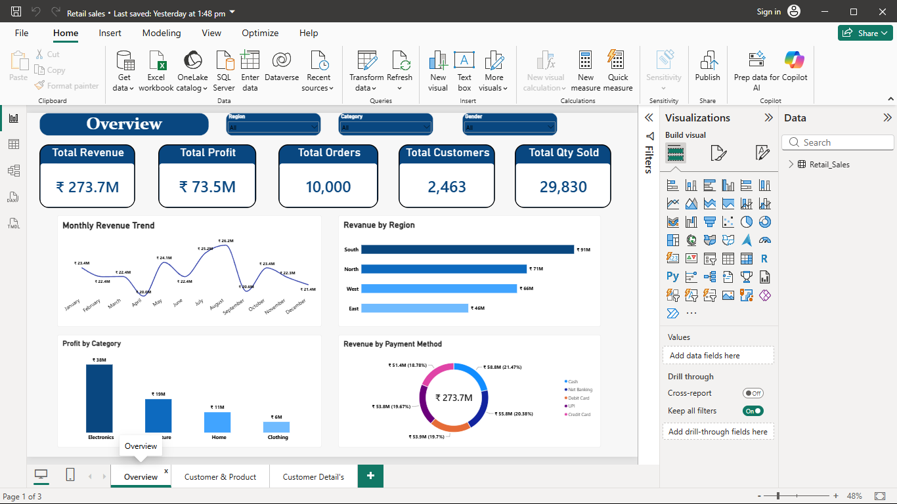

# 🛍️ Retail Sales Analysis Dashboard

An interactive Power BI dashboard built using **10,000 retail sales records** to analyze revenue, profit, customer behavior, and product performance.

---

## 📊 Dashboard Preview

### Overview

### Customer & Product

### Customer Details (Drill-through)

---

## 🎯 Business Problem

Retail businesses need a quick way to identify high-performing products, profitable customer segments, regional sales trends, and customer purchasing behavior to improve business decisions.

---

## 🛠️ Tools Used

* Power BI
* DAX
* Excel
* SQL

---

## 📈 Key Insights

* 10,000 retail sales transactions analyzed
* Interactive executive dashboard with KPIs
* Monthly revenue trend analysis
* Revenue by region and payment method
* Top 10 products by revenue
* Customer drill-through detail page

---

## 📁 Project Files

* Retail Sales Dashboard.pbix
* Retail_Sales_Dataset_10000.xlsx
* Screenshots

---

**Author:** S. Ravindranathan
