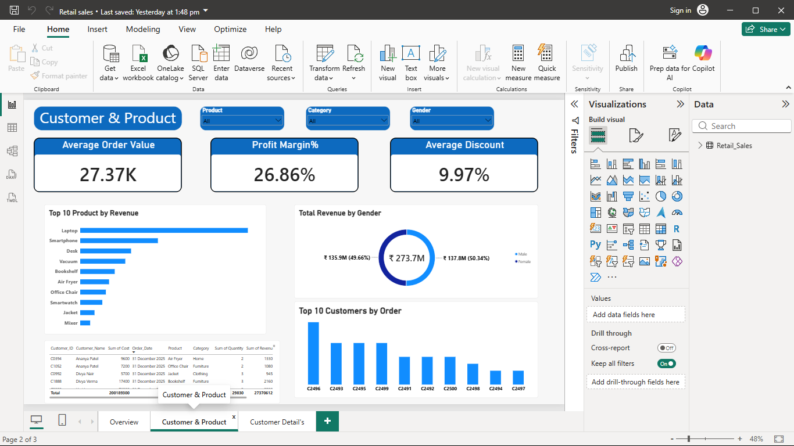
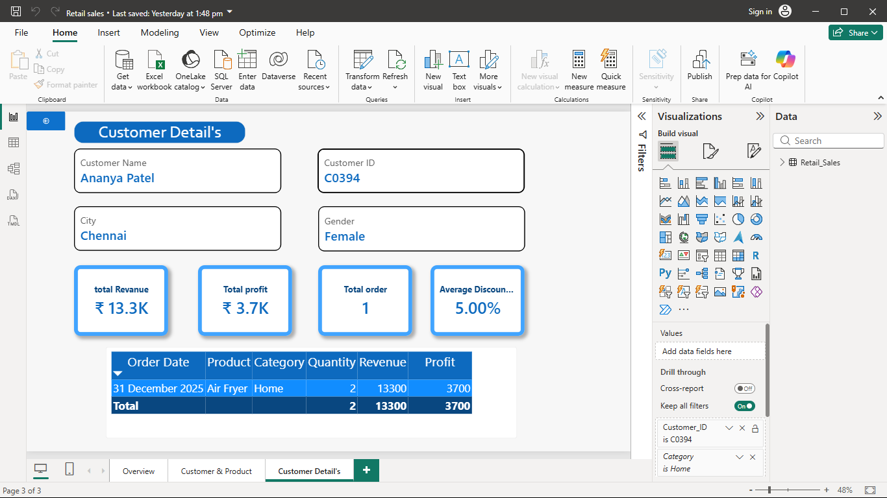

# 🛍️ Retail Sales Analysis Dashboard

An interactive **Power BI** dashboard built using **10,000 retail sales records** to analyze revenue, profit, customer behavior, product performance, and regional sales trends.

---

## 📊 Dashboard Preview

### Executive Overview

### Customer & Product Analysis

### Customer Details (Drill-through)

---

## 🎯 Business Problem

Retail businesses need a centralized dashboard to monitor sales performance, identify high-performing products, understand customer purchasing behavior, and improve business decisions through data-driven insights.

---

## 🛠️ Tools Used

* Power BI
* DAX
* SQL
* Excel

---

## ✨ Dashboard Features

* Executive sales KPI dashboard
* Revenue & profit analysis
* Customer and product insights
* Regional sales performance
* Payment method analysis
* Customer drill-through page
* Interactive slicers

---

## 📈 Key Insights

* Analyzed **10,000 retail sales records**
* Identified top-performing products and customers
* Compared revenue across regions
* Tracked monthly sales trends
* Enabled customer-level drill-through analysis

---

## 📁 Project Files

* `Retail-Sales-Dashboard.pbix`
* `Retail_Sales_Dataset_10000.xlsx`
* `screenshots/Overview.png`
* `screenshots/Customer_Product.png`
* `screenshots/Customer_Details.png`

---

## 👨‍💻 Author

**S. Ravindranathan**
